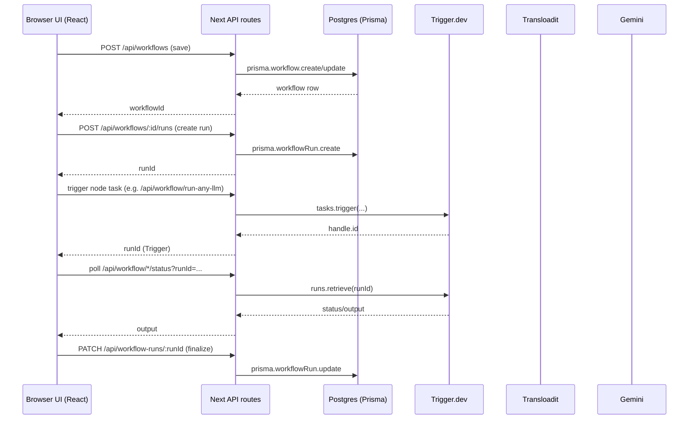

# Architecture

## High-level overview

`galaxy.ai` is a Next.js App Router app that provides:

- A workflow editor UI (React Flow canvas)
- A small workflow “engine” that can execute nodes in DAG order
- Persistence for workflows and execution history (Postgres via Prisma)
- Background jobs for media processing and LLM calls (Trigger.dev)

## Request/Execution flow

## Code map

### UI routes (App Router)

- `/` redirects to `/nodes`: `src/app/page.tsx`
- `/nodes` landing shelf: `src/app/nodes/page.tsx` → `src/components/landing/WorkflowLandingPage.tsx`
- `/nodes/new` creates a UUID and redirects to `/nodes/[workflowId]?new=1` (auth required): `src/app/nodes/new/page.tsx`
- `/nodes/[workflowId]` workflow editor (auth required): `src/app/nodes/[workflowId]/page.tsx`
- `/sign-in`, `/sign-up`, `/sso-callback`: Clerk auth pages in `src/app/*`

### API routes

Workflows:

- `GET /api/workflows?limit=N` — list current user workflows
- `POST /api/workflows` — create workflow
- `GET /api/workflows/:workflowId` — fetch one workflow
- `PATCH /api/workflows/:workflowId` — update workflow
- `GET /api/workflows/:workflowId/runs` — list workflow runs + node runs
- `POST /api/workflows/:workflowId/runs` — create a workflow run row

Execution history:

- `PATCH /api/workflow-runs/:runId` — finalize/update run status and metadata
- `POST /api/workflow-runs/:runId/node-runs` — create node-run row
- `PATCH /api/workflow-runs/:runId/node-runs/:nodeRunId` — update node-run row

Integrations:

- `POST /api/transloadit/sign` — return signed upload params/signature
- `GET /api/gemini/models` — list Gemini models for selector

Trigger-backed node execution:

- `POST /api/workflow/run-any-llm` + `GET /api/workflow/run-any-llm/status`
- `POST /api/workflow/crop-image` + `GET /api/workflow/crop-image/status`
- `POST /api/workflow/extract-frame` + `GET /api/workflow/extract-frame/status`

### Workflow engine

Core logic lives in `src/lib/workflow/**`:

- DAG planning + cycle detection: `execution-planner.ts`
- Input resolution from upstream outputs: `execution-input-resolver.ts`
- Node execution implementations (fetch + poll APIs): `node-executors.ts`
- Execution loop + callbacks: `workflow-executor.ts`
- Connection rules (handle types, cycles, fan-in): `connection-types.ts`, `connection-validator.ts`

### Background tasks (Trigger.dev)

Tasks live in `src/trigger/**`:

- `run-any-llm.ts` — Gemini request (text + optional inline images)
- `crop-image.ts` — ffmpeg crop → upload to Transloadit
- `extract-frame.ts` — ffmpeg frame extraction → upload to Transloadit

They are configured by `trigger.config.ts`.

## Persistence model (Prisma)

See `prisma/schema.prisma`:

- `Workflow` — user-owned workflow graph (`nodes`, `edges` stored as JSON)
- `WorkflowRun` — a single execution attempt (scope/status/timing)
- `NodeRun` — per-node execution telemetry (status/timing/inputs/outputs/errors)
